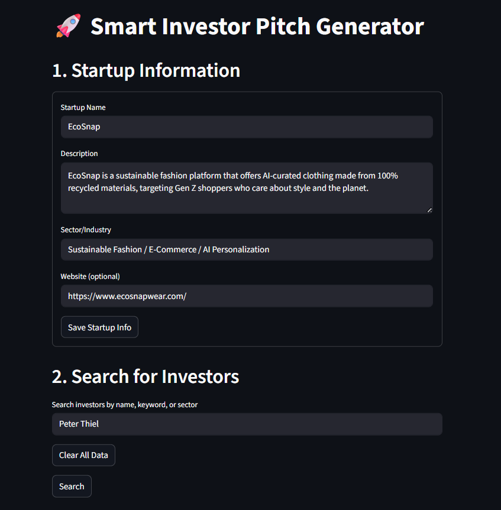
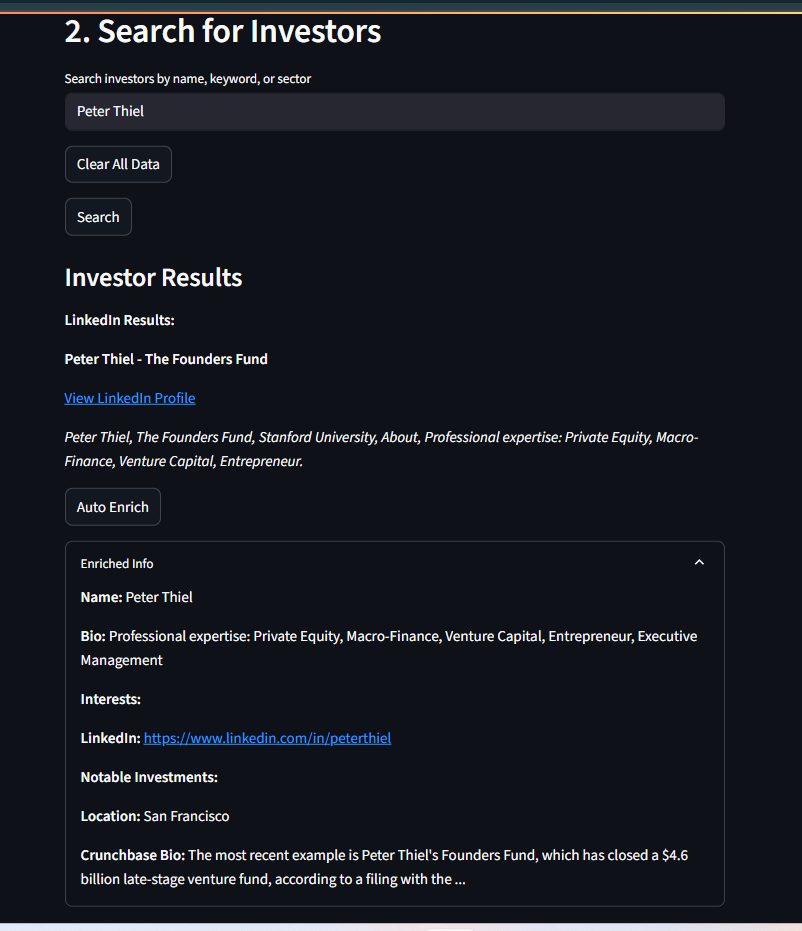
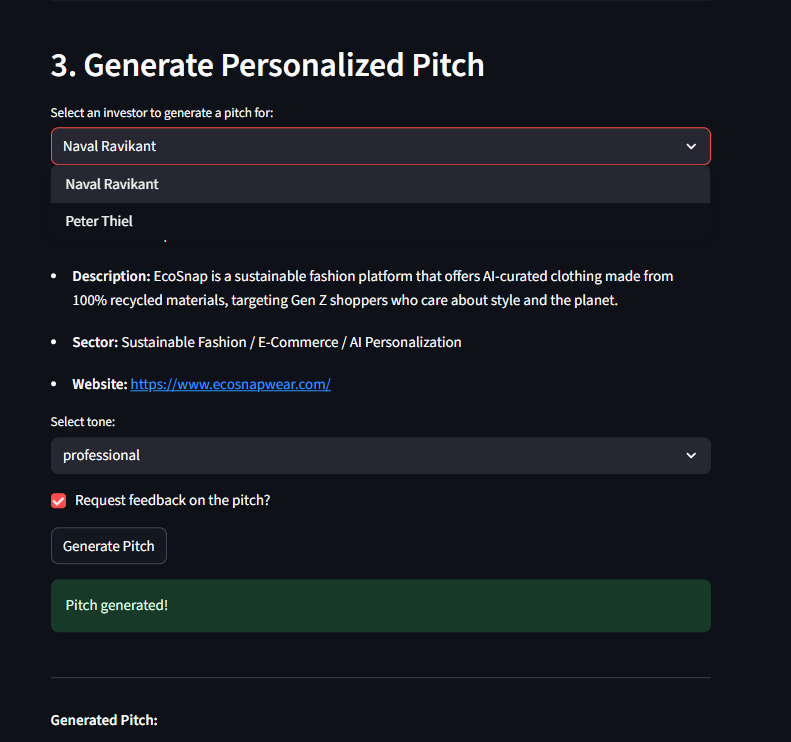
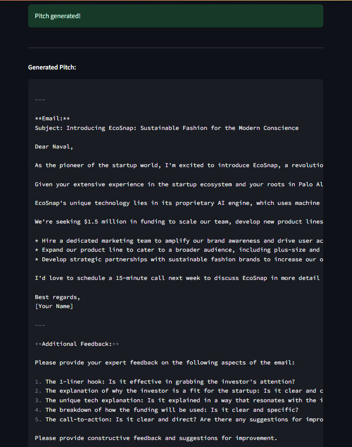

# Smart Investor Pitch Generator

An AI-powered Streamlit application that leverages LLaMA 3 and LangChain to generate highly personalized investor pitch emails and one-pagers for startups. The system intelligently analyzes your startup's niche, traction, and goals, and aligns them with investor interests and investment thesis. It features dynamic Retrieval-Augmented Generation (RAG) for real-time, custom investor insights using Crunchbase and LinkedIn data, ensuring every pitch is tailored for maximum impact.

## Features
- Enter and manage multiple startup profiles
- Search for investors by name, keyword, or sector (Google, LinkedIn, Crunchbase)
- Enrich investor profiles with detailed info (bio, interests, notable investments)
- Generate highly personalized pitch emails using LLaMA 3 (via Together.ai API)
- Copy pitch to clipboard
- Persistent storage of startup and investor data (file-based)

## Tech Stack
- **Frontend:** Streamlit (Python)
- **Backend:** FastAPI (Python), LangChain, LLaMA 3 (Together.ai), SerpAPI, Proxycurl

## Setup Instructions

### 1. Clone the repository
```bash
git clone <your-repo-url>
cd investor-pitch-generator
```

### 2. Install dependencies
```bash
cd streamlit_frontend
pip install -r requirements.txt
```

### 3. Set up environment variables
- Create a `.env` file in your backend directory with the following keys:
  - `TOGETHER_API_KEY` (for LLaMA 3 via Together.ai)
  - `SERPAPI_KEY` (for Google/LinkedIn/Crunchbase search)
  - `PROXYCURL_KEY` (optional, for LinkedIn enrichment)

### 4. Run the backend (FastAPI)
```bash
# From the backend directory
uvicorn main:app --reload
```

### 5. Run the frontend (Streamlit)
```bash
# From the streamlit_frontend directory
streamlit run app.py
```

## Usage
1. Enter your startup info and save it.
2. Search for investors and enrich their profiles.
3. Generate a personalized pitch for any enriched investor.
4. Copy the pitch to your clipboard and use it in your outreach!

## File-based Persistence
- Startup info, investor search results, and enriched investors are saved as JSON files in the frontend directory for persistence across sessions.

## Output Screenshots

Below are screenshots of the app in action:






## Credits
- Built with [Streamlit](https://streamlit.io/), [FastAPI](https://fastapi.tiangolo.com/), [LangChain](https://www.langchain.com/), [Together.ai](https://www.together.ai/), [SerpAPI](https://serpapi.com/), and [Proxycurl](https://nubela.co/proxycurl).

---

**MIT License** 